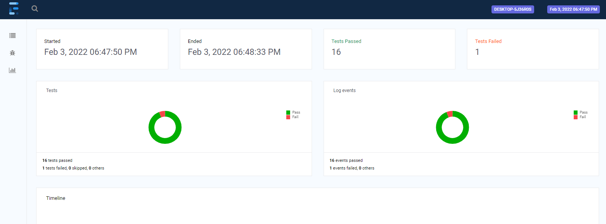

# MckMakler_Task

## Project component 

### An End to End  adn API testing for https://admin-advertisement.herokuapp.com/
### The Framework cosists of the following dependencies : [ Selenium, REST-ASSURED, JSON Simple, TestNG, Extent Report, Log4j ] and these are managed using Maven
## The pogramming lang used in this framework is JAVA

## Project structure

### This project consists of three regression suites and three execution profiles 
### 1. UI regression suite [it will execute all the UI related tests ]
### 2. API regression suite [it will execute all the API related tests ]
### 2. Regression regression suite [it will execute all tests ]

## How to execute
### 1. clone the project on your local device 
### 2. makesure to have JDK installed on your machine and any IDE
### 3. to execute UI profile use mvn test -P UI 
### 4. to execute API profile use mvn test -P API 
### 5. to execute Regression profile use mvn test -P Regression 

##After Execution
### you will find an execution html report in the following path ./test-output/Report.html

## Output Screenshoot 

